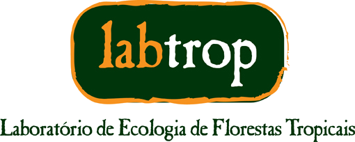

<style>
.cover-header {
  text-align: center;
  padding: 2.5rem 1rem 1.5rem 1rem;
  border-bottom: 1px solid #e5e5e5;
  margin-bottom: 2rem;
}
.cover-header img {
  max-width: 200px;
  margin: 0 auto 1.5rem auto;
  display: block;
}
.cover-header h1 {
  font-size: 2.6rem;
  margin: 0 0 1rem 0;
  font-weight: 700;
}
.cover-header .subtitle {
  font-size: 1.15rem;
  color: #555;
  max-width: 750px;
  margin: 0 auto 1.5rem auto;
  line-height: 1.5;
}
.cover-header .author {
  font-size: 1rem;
  color: #333;
  margin-top: 1.5rem;
  line-height: 1.5;
}
.contexto-box {
  background: #f5f5f5;
  border-radius: 8px;
  padding: 1.5rem 2rem;
  max-width: 850px;
  margin: 1rem auto 3rem auto;
  text-align: justify;
  line-height: 1.6;
  color: #222;
  border-left: 4px solid #1F7A8C;
}
.contexto-box h3 {
  margin-top: 0;
  font-size: 1rem;
  letter-spacing: 0.1em;
  text-transform: uppercase;
  color: #1F7A8C;
}
.docs-grid {
  display: grid;
  grid-template-columns: 1fr 1fr;
  gap: 1.5rem;
  max-width: 900px;
  margin: 1rem auto 3rem auto;
}
.docs-grid a {
  text-decoration: none;
  color: inherit;
  border: 1px solid #e5e5e5;
  border-radius: 8px;
  padding: 1.25rem;
  display: block;
  transition: all 0.2s;
}
.docs-grid a:hover {
  border-color: #1F7A8C;
  box-shadow: 0 4px 12px rgba(0,0,0,0.08);
  transform: translateY(-2px);
}
.docs-grid h3 {
  margin-top: 0;
  color: #1F7A8C;
}
.docs-grid p {
  margin-bottom: 0;
  color: #555;
  font-size: 0.95rem;
}
@media (max-width: 700px) {
  .docs-grid { grid-template-columns: 1fr; }
}
</style>

<div class="cover-header">
  
  <h1>Manual odkTreeCensus</h1>
  <p class="subtitle">Pacote do R para coleta de dados em campo por dispositivo móvel utilizando o ODK Collect</p>
  <p class="author">
    Alexandre Adalardo de Oliveira<br/>
    <small>Departamento de Ecologia &mdash; IBUSP</small>
  </p>
</div>

<div class="contexto-box">
<h3>Contexto</h3>
<p>O procedimento de coleta de dados em campo tem fontes de incertezas e erros envolvidas na aquisição da informação. Entre as fontes de erros mais importantes nos inventários florestais estão: anotação do dado em campo e transcrição da informação para o formato digital. Esses erros são custosos para serem resolvidos, muitas vezes demandando o retorno a campo, o que nem sempre é possível. Evitar fontes de erros no procedimento científico é essencial para não comprometer as conclusões dos trabalhos científicos. O pacote <strong>odkTreeCensus</strong> tem como objetivos minimizar a entrada de dados com discrepâncias durante a aquisição da informação e eliminar a fase de transcrição de dados anotados em papel. O pacote auxilia na construção e gerenciamento de formulários de entrada de dados para o aplicativo ODK-Collect, criando os arquivos necessários e gerenciando a entrada e saída de dados.</p>
</div>

## Documentação

<div class="docs-grid">
<a href="prepareODKCollect.html">
<h3>Preparando o ODK Collect</h3>
<p>Instalação do pacote, criação dos arquivos auxiliares (csv, mapas e grids SVG) e envio do formulário para o dispositivo Android.</p>
</a>
<a href="useTreeCensusForm.html">
<h3>Usando o formulário CensoPPSP2025</h3>
<p>Guia passo a passo do preenchimento do formulário no aplicativo ODK Collect.</p>
</a>
</div>

## Outros formatos

As mesmas vinhetas também estão disponíveis em **PDF** pré-compiladas em `inst/doc/`, dentro do pacote. No R, execute:

```r
vignette(package = "odkTreeCensus")
```
